# MSH Database Model Visualization

## Current Database Schema

### Core Entities

```mermaid
erDiagram
    ApplicationUsers {
        string Id PK
        string UserName
        string Email
        datetime CreatedAt
        datetime UpdatedAt
        bool IsDeleted
    }
    
    Rooms {
        uuid Id PK
        string Name
        string Description
        datetime CreatedAt
        datetime UpdatedAt
        bool IsDeleted
        string CreatedById FK
        string UpdatedById FK
    }
    
    DeviceTypes {
        uuid Id PK
        string Name
        string Description
        jsonb Capabilities
        bool IsSimulated
        datetime CreatedAt
        datetime UpdatedAt
        bool IsDeleted
        string CreatedById FK
        string UpdatedById FK
    }
    
    Devices {
        uuid Id PK
        string Name
        string Description
        string MatterDeviceId
        uuid DeviceTypeId FK
        uuid RoomId FK
        jsonb Properties
        string Status
        jsonb Configuration
        datetime LastStateChange
        bool IsOnline
        datetime LastSeen
        datetime CreatedAt
        datetime UpdatedAt
        bool IsDeleted
        string CreatedById FK
        string UpdatedById FK
    }
    
    DeviceGroups {
        uuid Id PK
        string Name
        string Description
        uuid RoomId FK
        datetime CreatedAt
        datetime UpdatedAt
        bool IsDeleted
        string CreatedById FK
        string UpdatedById FK
    }
    
    Groups {
        uuid Id PK
        string Name
        string Description
        datetime CreatedAt
        datetime UpdatedAt
        bool IsDeleted
        string CreatedById FK
        string UpdatedById FK
    }
    
    GroupMembers {
        uuid GroupId PK,FK
        uuid DeviceId PK,FK
        datetime CreatedAt
        datetime UpdatedAt
        bool IsDeleted
        string CreatedById FK
        string UpdatedById FK
    }
    
    DeviceStates {
        uuid Id PK
        uuid DeviceId FK
        string StateType
        jsonb StateValue
        datetime RecordedAt
        datetime CreatedAt
        datetime UpdatedAt
        bool IsDeleted
        string CreatedById FK
        string UpdatedById FK
    }
    
    DeviceEvents {
        uuid Id PK
        uuid DeviceId FK
        string EventType
        jsonb EventData
        datetime CreatedAt
        datetime UpdatedAt
        bool IsDeleted
        string CreatedById FK
        string UpdatedById FK
    }
    
    GroupStates {
        uuid GroupId PK,FK
        jsonb State
        datetime LastUpdated
        datetime CreatedAt
        datetime UpdatedAt
        bool IsDeleted
        string CreatedById FK
        string UpdatedById FK
    }
    
    GroupStateHistory {
        uuid Id PK
        uuid GroupId FK
        jsonb OldState
        jsonb NewState
        datetime CreatedAt
        datetime UpdatedAt
        bool IsDeleted
        string CreatedById FK
        string UpdatedById FK
    }
    
    Rules {
        uuid Id PK
        string Name
        string Description
        bool IsActive
        datetime CreatedAt
        datetime UpdatedAt
        bool IsDeleted
        string CreatedById FK
        string UpdatedById FK
    }
    
    RuleConditions {
        uuid Id PK
        uuid RuleId FK
        jsonb Condition
        datetime CreatedAt
        datetime UpdatedAt
        bool IsDeleted
        string CreatedById FK
        string UpdatedById FK
    }
    
    RuleActions {
        uuid Id PK
        uuid RuleId FK
        jsonb Action
        datetime CreatedAt
        datetime UpdatedAt
        bool IsDeleted
        string CreatedById FK
        string UpdatedById FK
    }
    
    RuleTriggers {
        uuid Id PK
        uuid RuleId FK
        jsonb Trigger
        datetime CreatedAt
        datetime UpdatedAt
        bool IsDeleted
        string CreatedById FK
        string UpdatedById FK
    }
    
    RuleExecutionHistory {
        uuid Id PK
        uuid RuleId FK
        jsonb Result
        datetime CreatedAt
        datetime UpdatedAt
        bool IsDeleted
        string CreatedById FK
        string UpdatedById FK
    }
    
    UserDevicePermissions {
        string UserId PK,FK
        uuid DeviceId PK,FK
        string PermissionLevel
        datetime CreatedAt
        datetime UpdatedAt
        bool IsDeleted
        string CreatedById FK
        string UpdatedById FK
    }
    
    UserRoomPermissions {
        string UserId PK,FK
        uuid RoomId PK,FK
        string PermissionLevel
        datetime CreatedAt
        datetime UpdatedAt
        bool IsDeleted
        string CreatedById FK
        string UpdatedById FK
    }
    
    EnvironmentalSettings {
        string UserId PK,FK
        double IndoorTemperatureMin
        double IndoorTemperatureMax
        double OutdoorTemperatureMin
        double OutdoorTemperatureMax
        double HumidityMin
        double HumidityMax
        double CO2Max
        double VOCMax
        double TemperatureWarning
        double HumidityWarning
        datetime LastUpdated
        datetime CreatedAt
        datetime UpdatedAt
        bool IsDeleted
        string CreatedById FK
        string UpdatedById FK
    }
    
    Notifications {
        uuid Id PK
        string UserId FK
        string Type
        string Title
        string Message
        jsonb Data
        bool IsRead
        datetime CreatedAt
        datetime UpdatedAt
        bool IsDeleted
        string CreatedById FK
        string UpdatedById FK
    }
    
    DeviceHistory {
        uuid Id PK
        uuid DeviceId FK
        string EventType
        jsonb OldState
        jsonb NewState
        string Description
        datetime CreatedAt
        datetime UpdatedAt
        bool IsDeleted
        string CreatedById FK
        string UpdatedById FK
    }
    
    UserSettings {
        string UserId PK,FK
        jsonb Settings
        datetime CreatedAt
        datetime UpdatedAt
        bool IsDeleted
        string CreatedById FK
        string UpdatedById FK
    }
```



## New Entities to Add

### Cluster Entity


### DevicePropertyChange Entity


### FirmwareUpdate Entity


### DeviceFirmwareUpdate Entity


## Relationships

### Current Relationships


### New Relationships


## Updated Device Properties Structure

### Current Device Properties
```json
{
  "model": "A8M",
  "manufacturer": "NOUS",
  "matter_version": "1.0"
}
```

### New Device Properties (Extended)
```json
{
  "model": "A8M",
  "manufacturer": "NOUS",
  "matter_version": "1.0",
  "clusters": [3, 4, 6, 29],
  "device_type": 266,
  "device_revision": 2,
  "cluster_revision": 1
}
```

## Key Features

### 1. Cluster Management
- **Clusters table**: Master table for all Matter protocol clusters
- **ClusterId**: Unique identifier (e.g., 3=Identify, 4=Groups, 6=OnOff, 29=Descriptor)
- **Category**: Classification (Basic, Measurement, Control, etc.)
- **MatterVersion**: Protocol version support
- **Attributes/Commands/Events**: JSON storage for cluster details

### 2. Device Property Change Tracking
- **DevicePropertyChanges table**: Audit trail for all property changes
- **ChangeType**: add, update, remove
- **Reason**: firmware_update, manual_change, discovery
- **Confirmation workflow**: Track if changes are confirmed

### 3. Firmware Update Management
- **FirmwareUpdates table**: Available firmware updates
- **DeviceFirmwareUpdates table**: Individual device update tracking
- **Status tracking**: pending, downloading, downloaded, installing, completed, failed, rolled_back
- **Test workflow**: Test completion and confirmation
- **Rollback support**: Track rollback availability and execution

### 4. Enhanced Device Properties
- **clusters array**: List of supported cluster IDs
- **device_type**: Matter device type (e.g., 266=Plug Unit)
- **device_revision**: Device hardware revision
- **cluster_revision**: Matter protocol version

## Benefits

1. **Complete Audit Trail**: Track all device property changes
2. **Firmware Management**: Comprehensive update workflow
3. **Cluster Awareness**: Know what capabilities each device supports
4. **Rollback Safety**: Safe firmware update process with testing
5. **Group Updates**: Update devices in groups after successful testing
6. **EF Core Integration**: Full ORM capabilities maintained
